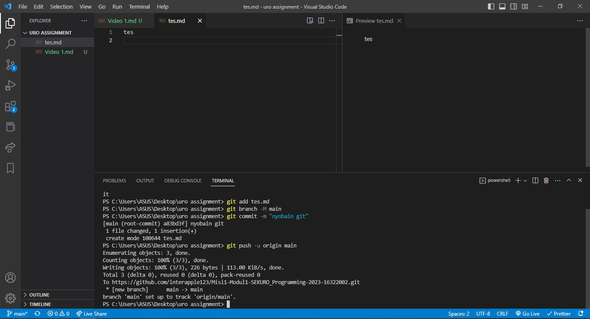

# GIT dan GITHUB

Git adalah salah satu dari _Version Control System_, disebut juga revision control system atau source code management adalah sistem yang mengelola sebuah perubahan. Version Control System merupakan salah satu solusi atas permasalahan apabila suatu program atau soft-file ingin diperbaiki, diperbaharui, atau penggabungan source code dari berbagai sumber.

Version Control System merupakan sebuah sistem yang menyimpan setiap perubahan juga memungkinkan kembali ke perubahan yang sebelumnya. Selain itu, kita juga bisa tahu siapa yang membuat perubahan tersebut.

## GIT

Git adalah sebuah VCS terdistribusi untuk mengelola perubahan file dalam folder (_repository/repo_). Riwayat perubahan file disimpan menggunakan serangkaian _commit_. Dalam setiap commit, git memberikan sebuah penanda, yaitu _hash_. Nama yang melakukan commit, tanggal, dan pesan commit. Branch adalah sebuah cabang untuk memisahkan pekerjaan programmer satu dengan yang lain atau ingin membuat sebuah perubahan yang belum pasti akan dipakai. Merge adalah ketika penggabungan branch yang lain dengan branch utama.

## GITHUB

Github adalah sebuah website untuk menyimpan file yang bisa dikelola menggunakan git. Di github kita juga bisa melakukan beberapa perintah git yang dilakukan dengan online.

Dengan kombinasi git dan github, file yang ada di local bisa di upload ke github atau bisa mengambil juga file yang ada di github.

