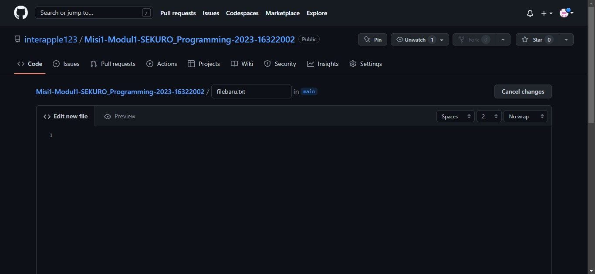

# Bekerja dengan Github

Di video 2 ini, saya belajar bagaimana membuat akun github dan repository baru. Ketika membuat repository baru, user diminta untuk memasukkan nama untuk repositorynya, deskripsi, serta tipe repo (public atau private). Selain itu, project disertakan file README.md. Di dalam repository diperlihatkan juga bagaimana membuat file di github. Setelah mengedit file yang dibuat, dilakukan sebuah commit agar menyimpan perubahan file tersebut.

Dalam perubahan-perubahan yang dibuat, diperlihatkan juga commit-commit yang dilakukan pada file tersebut.

