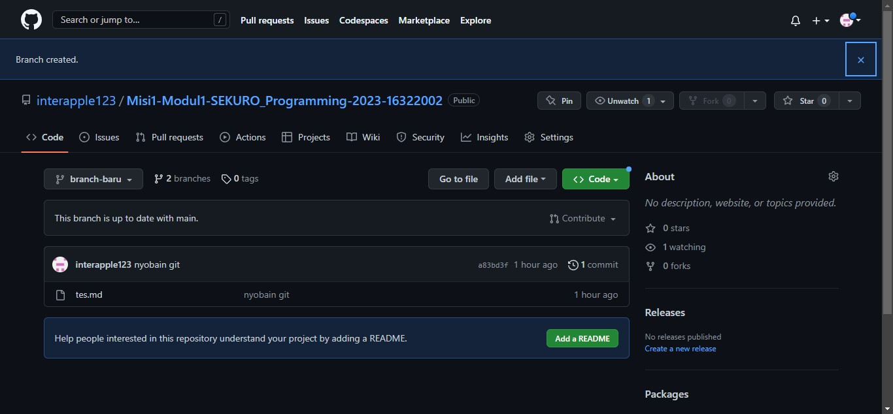

# Branch

Salah satu fungsi branch dalam pembuatan suatu software adalah ketika ingin membuat satu fitur tertentu, tetapi belum pasti apakah fitur tersebut akan ditambahkan ke software yang telah dibuat atau tidak. Dalam satu repo bisa membuat beberapa branch. Branch tidak akan mengganggu jalur utama (master branch).

Dalam video, diperlihatkan berbagai cara membuat branch. File akan diubah dalam branch yang baru, berbeda dengan master branch. Perubahan yang dilakukan pada branch baru tidak akan memengaruhi master branch.

Ketika ada merge conflict, pemilik branch ketika menerima pull request, harus diselesaikan terlebih dahulu (resolve conlflict) agar bisa melakukan merge branch ke master branch.

# Merge

Merge adalah ketika menggabungkan branch ke master branch. Diperlihatkan bagaimana caranya merging branch baru dengan branch utama. Dalam merging, perlu dilakukan request (pull request) untuk melakukan merge kepada pemilik branch (konteks di sini master branch). Setelah memutuskan akan menerima request tersebut atau tidak, jika ya akan ada update dalam master branch akibat branch baru.

