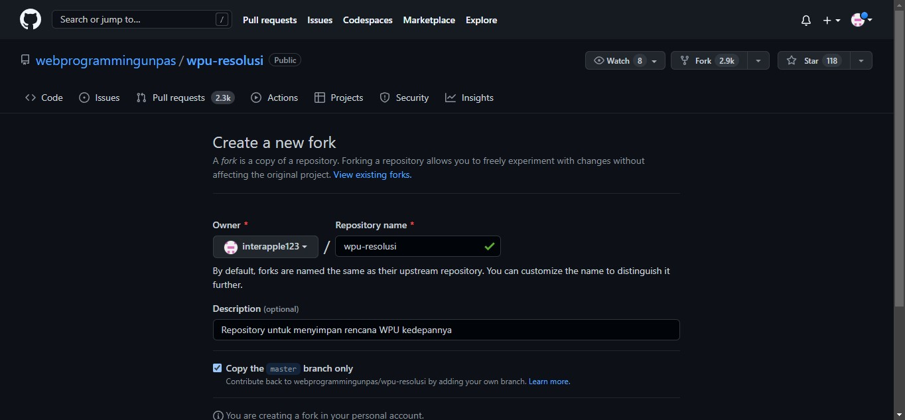

# Fork

Fork merupakan sebuah metode duplikasi repo orang lain. Fork tidak sama dengan clone. Fork adalah duplikasi ke repo di github sedangkan clone duplikasi ke local repo. Dalam video, diperlihatkan bagaimana caranya melakukan fork repo orang lain di github.

Profile github -> Fork

Setelah melakukan perubahan dalam repo yang sudah difork, akan dilakukan pull request. Pemilik repo yang difork akan menerima request dan memutuskan akan menerimanya atau tidak dengan mengklik merge.

