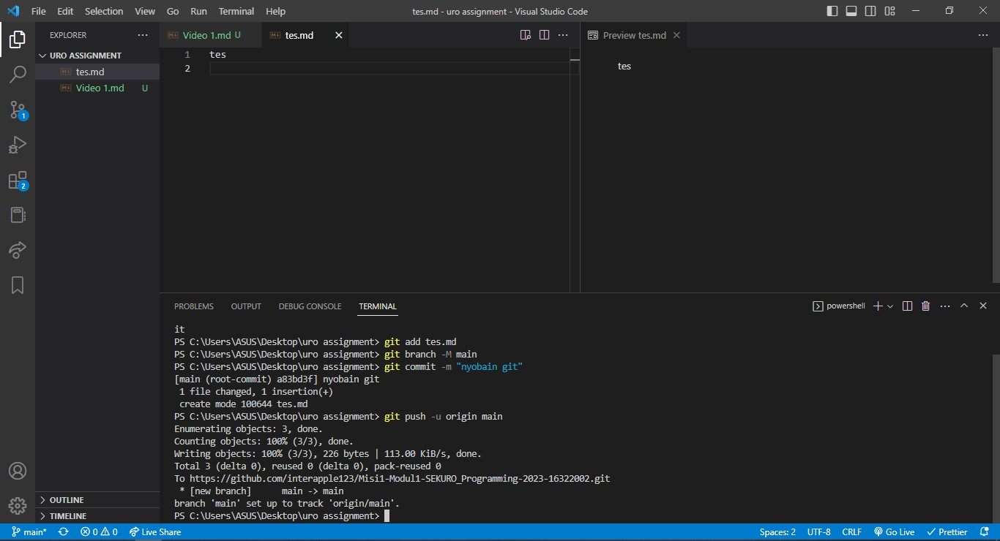

# Bekerja dengan Git

Dalam video, diperlihatkan bagaimana caranya menginstall git. Selain itu, diperlihatkan pula cara pengoperasian git-bash.

Beberapa command-command git:

1. git init: membuat repo
2. git add: menambahkan file ke staging area
3. git status: untuk mengetahui status repo
4. git commit: untuk melakukan commit
5. git config: untuk menkonfigurasi repo
6. git branch: untuk membuat branch
7. git help: untuk tahu bagaimana perintah-perintah git

3 area pada repo git:

1. Working tree, tempat folder kita bekerja
2. Staging area, memberitahu beberapa perubahan
3. History, setelah melakukan commit, perubahan akan masuk ke area ini

- Ketika sudah menginisialisasikan folder git, dalam folder akan muncul file hidden .git.

Setelah melakukan perubahan, bisa disimpan ke dalam staging area. Lalu, melakukan commit untuk menyimpan perubahan tersebut dari staging area ke history.

Untuk membuat repo git, dalam git-bash harus masuk ke dalam folder terlebih dahulu.

Untuk melihat commit-commit sebelumnya dengan siapa yang melakukan commit tersebut bisa dilakukan dengan _git log_.

