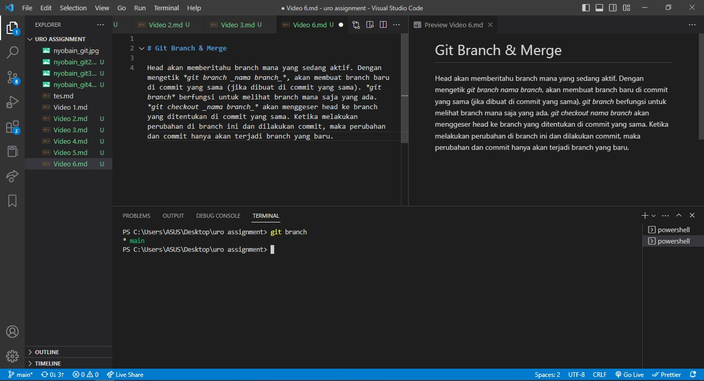

# Git Branch & Merge

Head akan memberitahu branch mana yang sedang aktif. Dengan mengetik _git branch *nama branch*_, akan membuat branch baru di commit yang sama (jika dibuat di commit yang sama). _git branch_ berfungsi untuk melihat branch mana saja yang ada. _git checkout *nama branch*_ akan menggeser head ke branch yang ditentukan di commit yang sama. Ketika melakukan perubahan di branch ini dan dilakukan commit, maka perubahan dan commit hanya akan terjadi branch yang baru.

Untuk menggabungkan branch-branch yang sudah dibuat dengan beberapa perubahannya, bisa dengan melakukan _git merge *nama branch*_. Pertama checkout ke master branch terlebih dahulu lalu lakukan git branch _nama branch_ ke branch yang ingin di-merge (fast-foward merging).

Untuk menghapus branch yang sekiranya sudah tidak dibutuhkan bisa dengan _git branch -d *nama branch*_. Jika ada branch yang belum di merge dengan master branch, huruf d pada perintah di atas diubah menjadi "D".

Jika saat merge tidak ada direct-path, merge yang dilakukan adalah three-way merge (akan dilakukan merge sekaligus commit baru).

