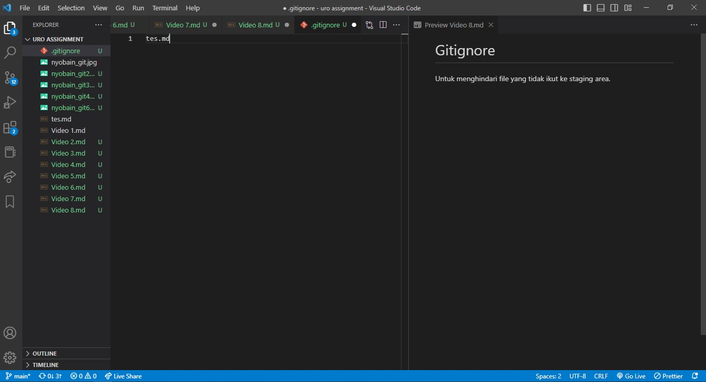

# Gitignore

Untuk menghindari file yang tidak ikut ke staging area. Caranya adalah dengan membuat file .gitignore dan masukkan nama file yang tidak ingin dimasukkan dalam staging area. Selain itu, folder juga bisa dimasukkan dalam .gitignore. dengan menuliskan nama_folder/ atau file yang ber-extension tertentu, seperti exe (tuliskan \*.exe).

